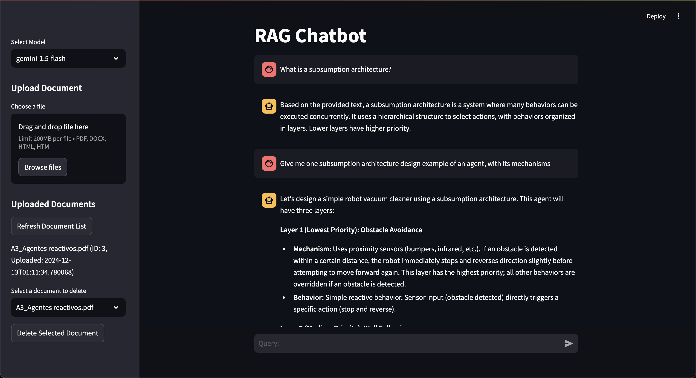

# LangChain RAG Chatbot

Introducing a sophisticated Retrieval-Augmented Generation (RAG) chatbot, built using LangChain, ChromaDB, FastAPI and Streamlit. This conversational agent integrates external data sources to deliver precise and contextually relevant responses, enhancing user interactions.

Key Features:

- Retrieval-Augmented Generation (RAG): Combines the strengths of retrieval-based and generative models, ensuring responses are both accurate and informative.

- ChromaDB indexing: Takes chunks of many document formats such as PDF, DOCX, HTML into embeddings, to generate a ChromaDB Vector DB with the help of the VertexAI Embedding model `text-embedding-005`

- LangChain Integration: Utilizes LangChain's robust framework to manage complex language processing tasks efficiently, with the help of chains.

Example below:

## Setup

### Requirements

- `Python 3.13.0`
- A GCP Console with a billing account linked

### Download dependencies

On `/` run:  
`pip install -r requirements.txt`

### Create DB Tables

On `api/` run:  
`python db_utils.py`

### Set Up GCP Service account with the following roles:

1. On IAM and Admin section of GCP, enter to the "service accounts" section and click on "create service account". Assign it the following roles

   - VertexAI User

2. On the same section, on the actions dropdown, select "Manage keys", and then "Add new key", JSON type, and then click on "download key"

3. Place this JSON file on the root folder (`/`)

### Create Gemini API key:

1. On APIs and Services section, go to "Credentials", and click on "Create credentials".
2. Click on API key, and then click on its actions dropdown, select "Restrict key". Select the following APIs:
   - Gemini for Google Cloud API
   - Vertex AI API

### ENV Variables

Rename .env.example into .env and fill the variables:

- GEMINI_API_KEY: THe API key generated for using Gemini Model
- PROJECT_ID: GCP Project ID
- URL: API base URL, alike to be `http://localhost:8000`

### With all this, you are all set! Ready to start the servers:

### Start the FastAPI Server:

On `api/` run:  
`uvicorn main:app --reload`

### Start the Streamlit server

On `app/` run:  
`streamlit run streamlit_app.py`
